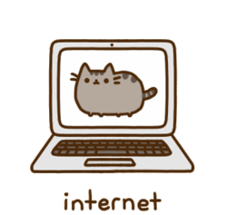

### Hi there 

**I'm a young and ambitious French developer at Ynov Informatique in Nantes.**

<hr>

**More about me:**

 
   
 - 🔭 I'm currently working on my new portfolio
 - 🌱 I’m currently learning <a href="https://remix.run/" target="_blank">`Remix`</a>
 - 💬 Ask me about anything, I love to share
 - 😄 Pronouns: He/Him
 - ⚙️ I use daily: `.ts` (of course), `.js`, `.html`, `.css`, `.php` (sometimes) and web design software, such as `Adobe XD` or `Figma`
 - 📝 Checkout my resume 👉 <a href="./assets/cv_lilian_ouvrard.pdf">`(Fr)`</a> or <a href="./assets/cv_lilian_ouvrard_US.pdf">`(Us)`</a> version
 - ⚡ Fun fact: Fan of the great Professor Layton 🎩
 - 📫 How to reach me: <a href="mailto:ouvrard.l@outlook.com">`Email`</a> / <a target="_blank" href="https://www.linkedin.com/in/lilian-ouvrard-b8130317b/">`LinkedIn`</a>

<hr>

**Languages and Tools:**  

<code></code>
<code></code>
<code></code>
<code></code>
<code></code>
<code></code>
<code></code>
<code></code>
<code></code>
<code></code>
<code></code>
<code></code>
<code></code>
<code></code>
<code></code>
<code></code>
<code></code>
<code></code>

<hr>

**Profil overview:** 

<!--START_SECTION:waka-->


**I'm an Early 🐤** 

```text
🌞 Morning    223 commits    █████░░░░░░░░░░░░░░░░░░░░   22.37% 
🌆 Daytime    580 commits    ██████████████░░░░░░░░░░░   58.17% 
🌃 Evening    167 commits    ████░░░░░░░░░░░░░░░░░░░░░   16.75% 
🌙 Night      27 commits     ░░░░░░░░░░░░░░░░░░░░░░░░░   2.71%

```


 Last Updated on 11/12/2022 01:09:13 UTC
<!--END_SECTION:waka-->

<hr>

**Other stats:** 


